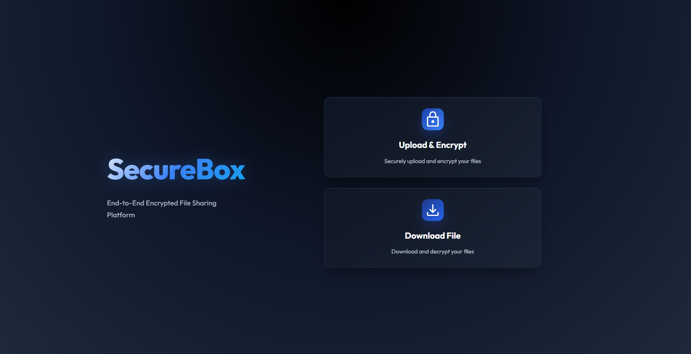

# 🔐 SecureBox - Encrypted File Sharing Platform

A secure, microservices-based file sharing platform that provides encrypted file storage with one-time download links and automatic expiration.

## 🏗️ Architecture

The platform consists of 4 main microservices:

1. **API Gateway** (Flask + Nginx) - Entry point for all requests
2. **Encryption Service** (FastAPI) - Handles file encryption/decryption
3. **Storage Service** (MinIO/S3) - Manages file storage and metadata
4. **Background Worker** (Celery) - Handles cleanup and background tasks


## 🚀 Quick Start

### Prerequisites
- Docker & Docker Compose
- Python 3.10+
- Kubernetes (optional, for production)

### Development Setup

1. Clone the repository
2. Copy environment configuration:
   ```bash
   cp .env.example .env
   ```
3. Start the services:
   ```bash
   docker-compose up -d
   ```

### API Endpoints

- `POST /upload` - Upload and encrypt a file
- `GET /download/<token>` - Download a file using one-time token
- `GET /status/<token>` - Check file status and metadata

## 🔧 Tech Stack

- **Backend**: Python 3.10+, Flask, FastAPI
- **Database**: PostgreSQL
- **Cache/Queue**: Redis
- **Storage**: MinIO (S3-compatible)
- **Containerization**: Docker
- **Orchestration**: Kubernetes + Helm
- **Monitoring**: Prometheus + Grafana

## 📁 Project Structure

```
SecureBox/
├── services/
│   ├── api-gateway/          # Flask API Gateway
│   ├── encryption-service/   # FastAPI Encryption Service
│   ├── storage-service/      # Storage management
│   └── background-worker/    # Celery background tasks
├── kubernetes/               # K8s manifests
├── helm/                    # Helm charts
├── docker-compose.yml       # Development environment
└── monitoring/              # Prometheus & Grafana configs
```

## 🔒 Security Features

- AES-256 encryption for all files
- RSA hybrid encryption support
- One-time download links
- Automatic file expiration
- Optional JWT authentication
- Secure key management

## 📊 Monitoring

- Health checks for all services
- Prometheus metrics collection
- Grafana dashboards
- Alert management

## 🚀 Deployment

### Local Development
```bash
docker-compose up -d
```

### Production (Kubernetes)
```bash
helm install securebox ./helm/securebox
```

## 🤝 Contributing

1. Fork the repository
2. Create a feature branch
3. Make your changes
4. Add tests
5. Submit a pull request

## 📄 License

MIT License - see LICENSE file for details
